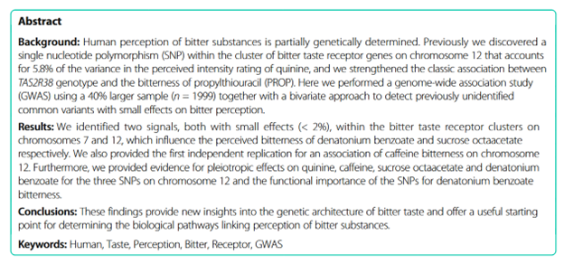

# Candidacy Journal Club

## Objective:

1.  present Hwang et al. (2018) as a journal club to the joint Simons-Cooperstone labs

## Present:

1.  Read the papers, *describe* the general methodologies used and data presented, and *summarize* it and its findings
2.  What do these findings *mean* for your own research?

### Citation:

Hwang et al. *BMC Genomics* (2018) 19:678 <https://doi.org/10.1186/s12864-018-5058-2>

### Helpful Videos:

[Explanation of GWAS for beginners](https://www.youtube.com/watch?v=sOP8WacfBM8)

[Intro to GWAS - Part 1](https://www.youtube.com/watch?v=Hjv_otXAkh0)

[Intro to GWAS - Part 2](https://www.youtube.com/watch?v=g1fQCC92WO0)

[NIH lecture](https://youtu.be/HHvdupHgeFg?si=zvgAl1gHi0-YxVmt)
